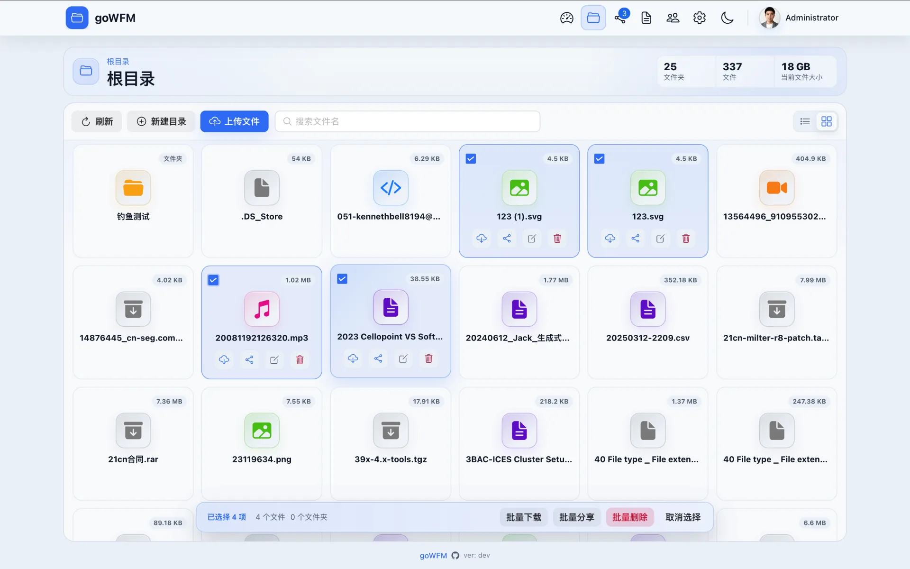
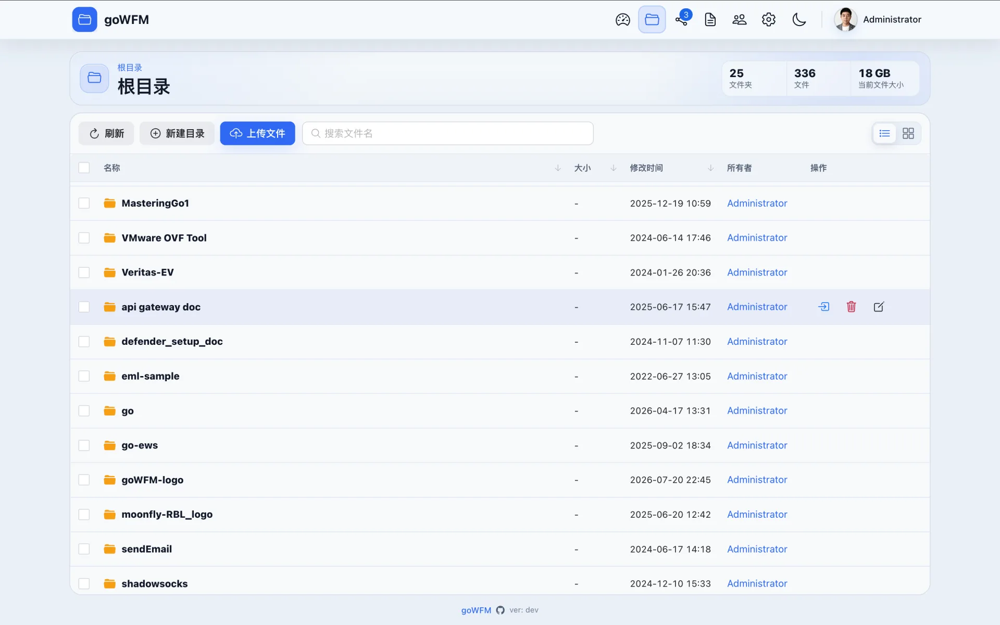
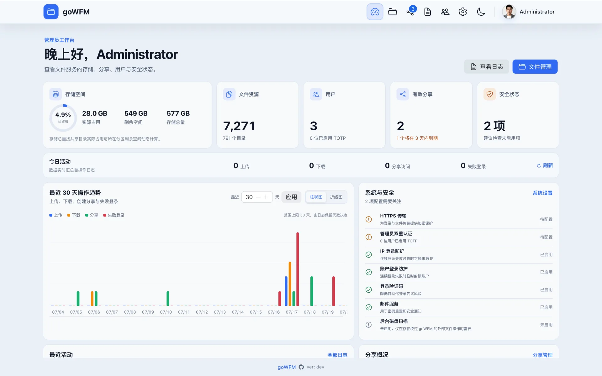
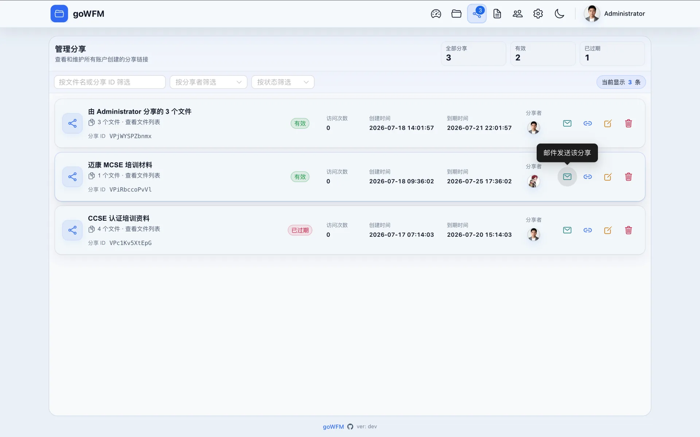
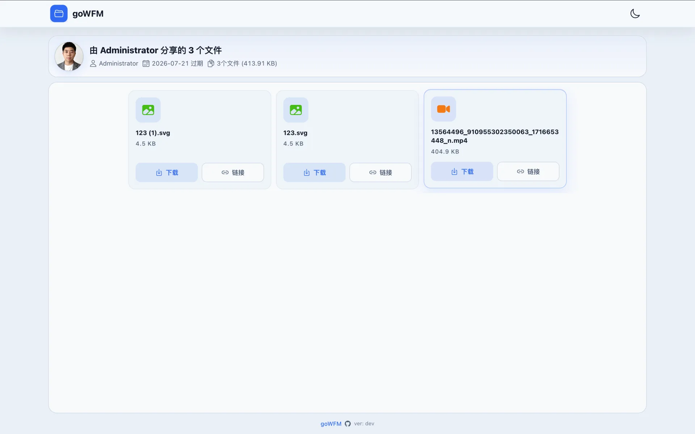
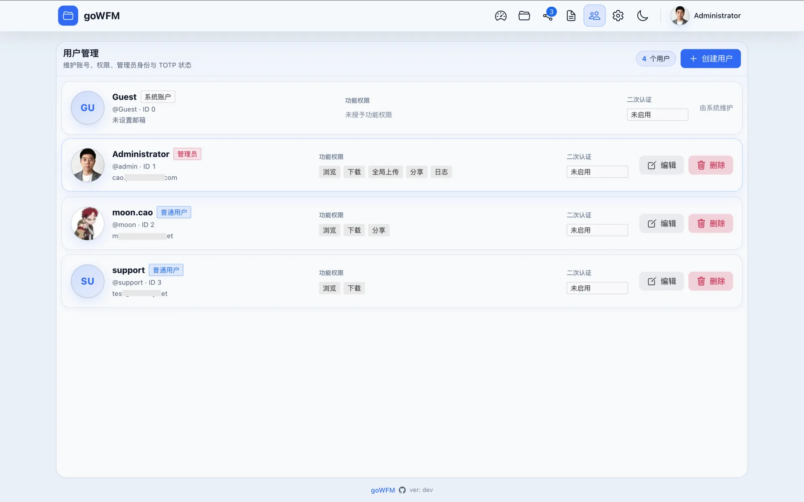

# Go Web File Manager (goWFM)


**简单 · 轻量 · 易用**  
一键把本地文件夹变成带登录、权限和分享功能的 Web 文件管理器，原来的目录结构完全不用动。

[项目网站](https://gowfm.dev/) · [下载 Release](https://github.com/m00nfly/goWFM/releases) · [问题反馈](https://github.com/m00nfly/goWFM/issues)

---

## 🖼️ 界面预览

点击缩略图查看原图；带视图切换和动效的版本可以前往 [项目网站](https://gowfm.dev/)。

<table>
  <tr>
    <td width="25%" align="center"><a href="docs/screenshots/file-explorer-card.webp"></a><br><sub>文件管理 · 卡片</sub></td>
    <td width="25%" align="center"><a href="docs/screenshots/file-explorer-list.webp"></a><br><sub>文件管理 · 列表</sub></td>
    <td width="25%" align="center"><a href="docs/screenshots/dashboard.webp"></a><br><sub>管理员仪表盘</sub></td>
    <td width="25%" align="center"><a href="docs/screenshots/share-manager.webp"></a><br><sub>分享管理</sub></td>
  </tr>
  <tr>
    <td width="25%" align="center"><a href="docs/screenshots/share-access.webp"></a><br><sub>公开分享</sub></td>
    <td width="25%" align="center"><a href="docs/screenshots/user-manager.webp"></a><br><sub>用户与权限</sub></td>
    <td width="25%" align="center"><a href="docs/screenshots/login.webp"></a><br><sub>登录页面</sub></td>
    <td width="25%"></td>
  </tr>
</table>

---

## ✨ 为什么你可能会需要 goWFM？

- 服务器、NAS 或树莓派里已经存了很多文件，想直接用浏览器访问。
- 原有目录整理得好好的，不想为了装一个网盘全部迁移一遍。
- Nginx `autoindex` 或 `python -m http.server` 虽然方便，但缺少登录、权限和分享控制。
- 偶尔要给朋友、同事或客户发几个文件，又不想让对方看到整个目录。
- 只想要一个简单的小工具，不想维护一整套数据库、缓存和容器服务。

**goWFM 做的事情很直接：** 指定一个本地目录，运行一个二进制文件，然后在浏览器里管理和分享它。它更适合个人、家庭服务器和开发者小团队，不打算替代大型协作网盘。

---

## 🚀 核心优势对比

| 功能维度 | 传统 HTTP 目录列表 | 常见私有云盘 | **goWFM** |
| --- | --- | --- | --- |
| 现有目录 | ✅ 直接读取 | 🟡 通常需要单独的数据目录和初始化 | ✅ **直接管理原始目录，不迁移文件** |
| 账号与权限 | ❌ 通常没有 | ✅ 功能完整 | ✅ **内置多用户，五类权限分别控制** |
| 登录安全 | ❌ 无 | 🟡 视方案而定 | ✅ **验证码、登录封锁、TOTP 与受信任设备** |
| 对外分享 | ❌ 需要额外工具 | ✅ 支持 | ✅ **多文件、有效期、短 ID、一次性下载链接** |
| 批量操作 | ❌ 无 | ✅ 支持 | ✅ **跨目录多选、批量下载、分享和删除** |
| 部署与依赖 | 🟢 简单 | 🟡 通常需要多个服务组件 | 🟢 **单二进制 + SQLite，无外部数据库** |
| 操作审计 | 🟡 主要是访问日志 | ✅ 视方案而定 | ✅ **登录、文件、分享和配置操作可筛选** |
| 文件所有权 | 🟡 依赖系统 UID/GID | ✅ 通常支持 | ✅ **记录创建者，管理员可调整** |
| 管理体验 | ❌ 基础目录页面 | ✅ 完整 | ✅ **仪表盘、响应式界面、明暗主题和品牌设置** |

简单来说：比目录列表多了安全和管理能力，又比完整私有云盘更轻、更容易部署。

---

## 📦 现在已经支持什么？

- 📁 **直接管理原始目录**
  指定 `data_root_path` 后直接读取现有文件。磁盘上怎么放，Web 页面里就怎么显示。

- 🖱️ **常用文件操作**
  支持上传、下载、创建目录、移动和删除，并提供列表与网格两种视图。

- ☑️ **跨目录多选与批量操作**
  在不同目录间切换时也能保留选择，可批量下载、分享或删除文件。

- ⚡ **大目录浏览优化**
  列表和卡片模式都做了虚拟化与缓存优化，文件多时滚动和切换更顺畅。

- 🔗 **多文件分享**
  一个分享可以放多个文件，支持自定义名称、有效期、逐文件下载统计和短分享 ID。

- 🎫 **一次性下载链接**
  公开分享页会为实际下载生成短时、一次性链接，降低链接被长期复用的风险。

- ✉️ **分享邮件与密码找回**
  配置并测试 SMTP 后，可以发送分享通知，也可以启用安全密码找回。

- 🔐 **登录安全**
  可选图形验证码、IP/账号失败封锁、IP 白名单，以及 TOTP 双因素认证。

- 👥 **多用户与权限**
  管理员账号名称可在初始化时自定义。普通用户可分别授予浏览、下载、全局上传、分享和日志权限。

- 🧑 **文件所有权与头像**
  文件和目录会记录创建者；普通用户管理自己创建的内容，管理员可以调整所有者。用户也可以设置头像和个人信息。

- 🧾 **操作日志**
  登录、上传、下载、移动、删除、分享和配置修改都有记录，匿名分享访问会记在系统 `Guest` 账号下。

- 📊 **管理员仪表盘**
  查看存储空间、文件类型、用户与分享概览、操作趋势和安全检查，支持手动或定时完整扫描。

- 🎨 **明暗主题与品牌设置**
  支持浅色、深色和跟随系统，可自定义站点名称、Logo、主题色、登录背景和 Markdown/HTML 品牌面板。

- 🪶 **单文件运行**
  Go 后端、Vue 前端和 SQLite 数据库组合成一个可执行程序，不需要额外安装数据库服务。

---

## ⚡ 快速开始

### 1️⃣ 下载

前往 [GitHub Releases](https://github.com/m00nfly/goWFM/releases)，下载与你的系统和架构对应的压缩包。构建流程目前覆盖 Linux、Windows 和 macOS。

### 2️⃣ 运行

下面假设你已经把解压后的平台文件重命名为 `gowfm`：

```bash
# Linux / macOS
chmod +x gowfm
./gowfm
```

数据库默认保存在当前目录的 `gowfm.db`。也可以自己指定位置：

```bash
./gowfm -db /path/to/gowfm.db
```

### 3️⃣ 完成初始化

浏览器打开 `http://your-server-ip:8080`，首次访问会自动进入初始化页面。你需要设置：

- 管理员账号、密码和邮箱
- 要管理的本地目录绝对路径
- 站点名称、访问地址、端口和最大上传大小

保存后就可以登录使用了。管理员账号不再固定为 `admin`，但 `Guest` 是系统保留账号。

### 4️⃣ 按需打开更多功能

进入“系统设置”后，可以继续配置验证码、登录封锁、TOTP 策略、SMTP、邮件模板、HTTPS、分享规则、主题和存储扫描。

> 端口、HTTPS 等启动相关设置修改后，需要按页面提示重启 goWFM。

---

## 🧭 适合这些使用场景

| 场景 | 原来的麻烦 | 用 goWFM 怎么做 |
| --- | --- | --- |
| **个人 NAS 远程访问** | 目录列表没有登录保护，完整网盘又太重 | 直接挂载现有目录，用账号和 TOTP 保护访问 |
| **给朋友或客户发文件** | 邮件附件太小，公共网盘又要上传一遍 | 选择多个文件，生成一个限时分享链接 |
| **小团队共享构建产物** | FTP/Samba 对临时成员不够方便 | 创建不同权限的账号，上传和下载都有日志 |
| **临时收集资料** | 不知道谁上传了什么 | 为参与者创建账号，用所有权和日志追踪来源 |
| **维护自己的下载站** | 静态目录缺少统计和管理页面 | 用分享管理、下载统计和仪表盘查看状态 |

---

## 🔧 配置与数据

goWFM 现在不再使用 `config.json`。配置保存在 SQLite 数据库中，并通过后台页面分类管理：

- 基础设置：站点名称、访问地址、数据根目录、最大上传大小
- 安全设置：Session、验证码、登录封锁、白名单、TOTP、密码找回
- 分享设置：默认有效期、数量限制、匿名下载、一次性链接时长、邮件分享
- 邮件设置：SMTP、发件人、测试激活状态、邮件模板
- 外观设置：端口、HTTPS、主题、Logo、登录背景和品牌面板
- 日志与扫描：日志保留策略、记录类型、定时存储扫描

建议一起备份：

1. 你的共享数据目录
2. `gowfm.db` 数据库文件

如果要放到公网使用，记得启用 HTTPS，并优先给管理员开启 TOTP。

---

## 🖥️ 从源码构建

### 前置要求

- Go 1.26.1 或与 `backend/go.mod` 兼容的更新版本
- Node.js、npm
- GNU Make

### 构建当前平台

```bash
git clone https://github.com/m00nfly/goWFM.git
cd goWFM
make
./gowfm
```

`make` 会安装前端依赖、构建 Vue 页面，再把静态资源嵌入 Go 二进制。

开发时可以在两个终端分别运行：

```bash
make dev-frontend
make dev-backend
```

构建全部发布平台：

```bash
make build-all-platforms
```

> 小心：`make clean` 会删除当前目录里的 `gowfm.db`、WAL 文件和构建产物，不要在真实数据目录里随手执行。

---

## 🧱 技术栈

| 部分 | 技术 |
| --- | --- |
| 后端 | Go、Gin、SQLite（modernc.org/sqlite，纯 Go 驱动） |
| 前端 | Vue 3、TypeScript、Vite、Naive UI、Pinia |
| 安全 | bcrypt、TOTP、验证码、Session 与登录封锁 |
| 打包 | Go `embed`、Make、Gitea Actions、GitHub Actions |

---

## 🤝 贡献与反馈

欢迎提交 Issue 和 Pull Request。改代码后建议跑一下：

```bash
go -C backend test ./...
npm --prefix frontend run build
```

如果你觉得 goWFM 正好解决了你的问题，欢迎点个 Star ⭐

## 📄 许可证

[MIT License](LICENSE)
